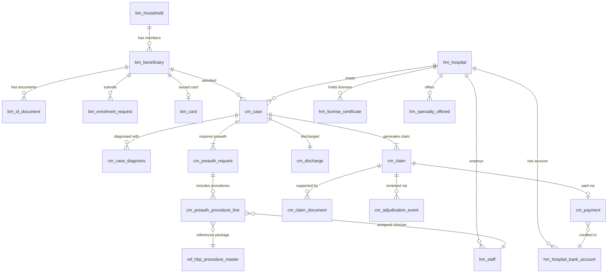

# Ayushman Bharat PM-JAY — Uttar Pradesh Synthetic Data Generator

**Ayushman Bharat Pradhan Mantri Jan Arogya Yojana (AB PM-JAY)** is India's flagship public health insurance scheme, providing cashless hospitalization cover of up to INR 5 lakh per family per year to economically vulnerable households. It covers secondary and tertiary care procedures across empanelled public and private hospitals nationwide.

This repository generates **realistic synthetic data** modelling the full PM-JAY operational pipeline for **Uttar Pradesh** — from beneficiary enrolment through hospital empanelment, case admission, pre-authorization, claims processing, adjudication, and payment settlement.

All data is synthetic. No real beneficiary information is included.

---

## Dataset Sizes

| Size | Households | Hospitals | ~Beneficiaries | ~Cases | ~Disk |
|------|-----------|-----------|----------------|--------|-------|
| **medium** | 50,000 | 800 | 200K | 22,500 | 300 MB |

Derived values: beneficiaries = households x 4.0 avg members; cases = households x 15% admission rate x 3 observation years.

---

## Data Model — 21 Tables

### A. Reference Tables (2)

#### `ref_up_geography.csv` — UP administrative hierarchy

| Column | Description |
|--------|-------------|
| `state_code` | Always `UP` |
| `state_name` | Always `Uttar Pradesh` |
| `division_name` | One of 18 UP divisions (e.g. Lucknow, Varanasi, Gorakhpur) |
| `district_name` | One of 75 UP districts |
| `block_name` | Administrative block within the district |

#### `ref_hbp_procedure_master.csv` — Health Benefit Package procedure catalogue

| Column | Description |
|--------|-------------|
| `hbp_procedure_code` | **PK.** e.g. `HBP-OBG-001`, `HBP-CARD-002` |
| `specialty_code` | Specialty abbreviation (OBG, GS, ORTH, MED, CARD, URO, OPTH, PEDS, NEURO, ONCO, ENT, DERM, PSYCH, NEPHRO, BURNS) |
| `specialty_name` | Full specialty name |
| `package_name` | Package grouping name |
| `procedure_name` | Specific procedure |
| `base_package_price` | Fixed package price in INR (5,000 – 200,000) |
| `has_stratification` | Whether stratification pricing applies |
| `has_implant_or_high_end` | Whether implant/high-end component is allowed |
| `procedure_label` | Always `STANDARD` |
| `reserved_public_hospitals_only` | Whether restricted to government hospitals |

25 procedures across 15 specialties.

---

### B. Beneficiary Management (5)

#### `bm_household.csv` — Enrolled households

| Column | Description |
|--------|-------------|
| `household_id` | **PK.** UUID |
| `family_id` | UP family ID (e.g. `UP123456789012`) |
| `entitlement_source` | SECC (60%), STATE_DB (25%), RSBY (15%) |
| `home_state_code` | Always `UP` |
| `home_state_name` | Always `Uttar Pradesh` |
| `home_district_code` | District name |
| `home_division_name` | Division name |
| `home_block_name` | Block name |
| `created_at` | ISO timestamp — 0–7 days before the earliest member's `created_at` |

**FK:** `home_district_code` references `ref_up_geography.district_name`

> **Post-generation fix applied:** `created_at` was originally a single date. Fixed to be 0–7 days before the earliest beneficiary enrolment in that household.

#### `bm_beneficiary.csv` — Individual beneficiaries

| Column | Description |
|--------|-------------|
| `beneficiary_id` | **PK.** UUID |
| `household_id` | **FK** -> `bm_household` |
| `pmjay_id` | Unique PM-JAY identifier (e.g. `PMJAYUPAB1234XYZ`) |
| `full_name` | Full name in uppercase |
| `father_or_spouse_name` | Father/spouse name (70% populated) |
| `gender` | `M` or `F` |
| `dob` | Date of birth (65% populated) |
| `yob` | Year of birth |
| `mobile` | 10-digit mobile (75% populated) |
| `address_text` | Address string |
| `photo_uri` | S3 photo URI (97% populated) |
| `bis_record_status` | GOLD (60%), SILVER (30%), PENDING (10%) |
| `ekyc_last_reference_id` | eKYC reference (80% populated) |
| `is_duplicate` | 3% are intentional duplicates with name/DOB variants |
| `created_at` | ISO timestamp — spread across 2022-01 to 2026-01, always before card issuance and first admission |
| `updated_at` | ISO timestamp — at or after `created_at` |

Name pools include Hindu and Muslim names (~19% Muslim) reflecting UP demographics. Duplicate records simulate real-world data quality issues with spelling variants.

> **Post-generation fix applied:** `created_at` and `updated_at` were originally all set to a single date (2026-02-27). Fixed to span 2022–2026 with the constraint: `household.created_at ≤ beneficiary.created_at ≤ card.issued_at ≤ first admission`. Beneficiaries with claims enrol at least 14 days before their first admission; those without claims follow a beta(2,3) distribution across the full window.

#### `bm_id_document.csv` — Identity documents

| Column | Description |
|--------|-------------|
| `id_doc_id` | **PK.** UUID |
| `beneficiary_id` | **FK** -> `bm_beneficiary` |
| `doc_type` | AADHAAR (80%), VOTER_ID, RATION_CARD, DRIVING_LICENSE, PAN |
| `doc_number_token` | Tokenized document number |
| `captured_name` | Name as captured on document |
| `captured_gender` | Gender as captured |
| `captured_age` | Age as captured |
| `captured_address_text` | Address as captured |
| `doc_scan_uri` | S3 scan URI (90% populated) |
| `created_at` | ISO timestamp |

#### `bm_enrolment_request.csv` — Enrolment workflow

| Column | Description |
|--------|-------------|
| `enrolment_request_id` | **PK.** UUID |
| `beneficiary_id` | **FK** -> `bm_beneficiary` |
| `reference_id` | Unique reference |
| `submitted_by_role` | BENEFICIARY, OPERATOR, AGENCY_OPERATOR |
| `auth_mode` | OTP, FINGERPRINT, IRIS, OFFLINE |
| `submitted_at` | ISO timestamp |
| `status` | AUTO_APPROVED (35%), ISA_APPROVED (35%), SHA_APPROVED (25%), REJECTED (5%) |
| `reviewed_at` | Review timestamp |
| `rejection_reason` | Reason if rejected (e.g. `PHOTO_MISMATCH`) |

#### `bm_card.csv` — Ayushman cards issued

| Column | Description |
|--------|-------------|
| `card_id` | **PK.** UUID |
| `beneficiary_id` | **FK** -> `bm_beneficiary` |
| `card_status` | ACTIVE (92%), INACTIVE (5%), DISABLED (3%) |
| `issued_at` | Issue date — 1–30 days after `beneficiary.created_at`, always before first admission |
| `card_pdf_uri` | S3 URI to card PDF |

> **Post-generation fix applied:** `issued_at` was originally a single date. Fixed to be 1–30 days after enrolment, with a hard constraint that it precedes the beneficiary's first hospital admission.

---

### C. Hospital Management (5)

#### `hm_hospital.csv` — Empanelled hospitals

| Column | Description |
|--------|-------------|
| `hospital_id` | **PK.** UUID |
| `hem_reference_no` | Hospital Empanelment reference |
| `hospital_name` | Hospital name |
| `hospital_parent_type` | Always `Single` |
| `hospital_type` | PUBLIC (60%) or PRIVATE (40%) |
| `hospital_sub_type` | Civil Hospital, CHC, PHC, Medical College, Private, Trust, NGO |
| `establishment_year` | Year of establishment |
| `state_name`, `state_code` | Always Uttar Pradesh / UP |
| `district_name`, `division_name`, `block_name` | Location |
| `pincode` | 6-digit PIN code |
| `geo_latitude`, `geo_longitude` | Coordinates |
| `org_head_name`, `org_head_contact`, `contact_email` | Contact info |
| `accreditation_board` | NABH, NABL, JCI, or blank |
| `accreditation_level` | FULL, PRE, or blank |
| `accreditation_valid_upto` | Expiry date |
| `delisted_from_gov_schemes` | 2% are delisted |
| `total_bed_strength`, `inpatient_beds` | Bed counts |
| `has_fully_equipped_ot`, `has_icu_with_ac`, `has_casualty`, `has_opd`, `has_hdu`, `has_general_ward`, `has_labour_room` | Facility flags |
| `created_at`, `updated_at` | Timestamps |

#### `hm_hospital_bank_account.csv` — Bank accounts for claim payments

| Column | Description |
|--------|-------------|
| `hospital_bank_id` | **PK.** UUID |
| `hospital_id` | **FK** -> `hm_hospital` |
| `authorized_signatory_name` | Signatory name |
| `bank_account_name` | Account name |
| `account_number_token` | Tokenized account number |
| `ifsc_code` | IFSC code |
| `bank_name` | SBI, Bank of Baroda, PNB, Canara Bank, etc. |
| `branch_name` | Branch |
| `tds_exemption` | Whether TDS-exempt (30%) |
| `cancelled_cheque_uri` | S3 URI |

#### `hm_license_certificate.csv` — Hospital licenses and certificates

| Column | Description |
|--------|-------------|
| `hospital_license_id` | **PK.** UUID |
| `hospital_id` | **FK** -> `hm_hospital` |
| `license_name` | Hospital Registration, Fire Safety, PCPNDT, NABH, etc. (13 types) |
| `certificate_no` | Certificate number |
| `issue_date` | Date issued |
| `expiry_date` | Expiry date (7% are already expired) |
| `attachment_uri` | S3 URI |

#### `hm_specialty_offered.csv` — Specialties per hospital

| Column | Description |
|--------|-------------|
| `hospital_specialty_id` | **PK.** UUID |
| `hospital_id` | **FK** -> `hm_hospital` |
| `specialty_code` | Specialty abbreviation |
| `specialty_name` | Full specialty name |
| `admissions_prev_fy` | Admissions in previous financial year |
| `admissions_before_last_year` | Admissions year before last |

> **Post-generation fix applied:** The original synthetic file had only ~2,840 rows and covered only 38% of actual case specialties. An additional 4,496 rows were added so that 97.4% of cases are treated at hospitals that formally list the relevant specialty. The remaining 2.6% are intentional anomalies (e.g. emergency referrals to hospitals without that specialty listed). Row count after fix: **7,336**.

#### `hm_staff.csv` — Medical staff

| Column | Description |
|--------|-------------|
| `staff_id` | **PK.** UUID |
| `hospital_id` | **FK** -> `hm_hospital` |
| `name` | Doctor name |
| `registration_number` | Medical registration number |
| `qualifications` | MBBS, MBBS MD, MBBS MS, MBBS MS MCh, MBBS MD DM, MBBS DNB, MBBS DA |
| `phone` | Mobile number |
| `email` | Email (mostly blank) |
| `experience_years` | Years of experience |
| `role_type` | PRIMARY_CLINICIAN, SURGEON, ANAESTHETIST, GYNAECOLOGIST, PAEDIATRICIAN, RADIOLOGIST |

---

### D. Claims Management (9)

#### `cm_case.csv` — Hospital admission cases

| Column | Description |
|--------|-------------|
| `case_id` | **PK.** UUID |
| `case_number` | Sequential case number |
| `beneficiary_id` | **FK** -> `bm_beneficiary` |
| `hospital_id` | **FK** -> `hm_hospital` |
| `hospital_district` | District of the treating hospital |
| `hospital_division` | Division of the treating hospital |
| `home_state_code` | Beneficiary's home state (always `UP`) |
| `hospital_state_code` | Hospital's state (`UP`, or `DL`/`MH`/`HR` etc. for portability) |
| `is_portability` | 4% are cross-state portability cases |
| `admission_datetime` | Admission timestamp |
| `admission_type` | EMERGENCY (15%) or ELECTIVE (85%) |
| `discharge_datetime` | Discharge timestamp |
| `discharge_type` | NORMAL (84%), LIVE (6%), LAMA (4%), DAMA (2%), DEATH (0.4%) |
| `created_at` | ISO timestamp |

#### `cm_case_diagnosis.csv` — ICD-10 diagnoses per case

| Column | Description |
|--------|-------------|
| `case_diagnosis_id` | **PK.** UUID |
| `case_id` | **FK** -> `cm_case` |
| `diagnosis_rank` | 1 for primary, 2+ for secondary |
| `diagnosis_type` | PRIMARY (1 per case) or SECONDARY (1-2 per case) |
| `code_system` | Always `ICD10` |
| `icd_code` | ICD-10 code (e.g. `O82`, `I21.9`, `A09`) |
| `diagnosis_text` | Human-readable diagnosis |

Diagnoses are weighted to reflect UP's disease burden:

| Category | Weight | Examples |
|----------|--------|----------|
| NCD | 30% | MI, heart failure, stroke, pneumonia, diabetes, CKD |
| Communicable | 28% | Diarrhoea, dengue, malaria, typhoid, TB |
| Maternal/Neonatal | 18% | C-section, normal delivery, pre-eclampsia, neonatal care |
| Surgical | 16% | Hernia, appendicitis, cataract, prostatectomy |
| Injury | 8% | Brain injury, bone fractures |

Eastern UP districts (Gorakhpur, Varanasi, Azamgarh, etc.) have 30% higher communicable disease rates and 20% higher maternal/neonatal rates.

#### `cm_preauth_request.csv` — Pre-authorization requests

| Column | Description |
|--------|-------------|
| `preauth_id` | **PK.** UUID |
| `case_id` | **FK** -> `cm_case` |
| `initiated_by_role` | PMAM, MEDCO, HOSPITAL_ADMIN |
| `initiated_at` | ISO timestamp |
| `status` | AUTO_APPROVED (35%), APPROVED (50%), QUERY_RAISED (12%), REJECTED (3%) |
| `auto_approval_type` | PACKAGE_LEVEL, FORCED_TAT, NONE |
| `ppd_decision_at` | Decision timestamp |
| `last_query_at` | Query timestamp (if queried) |
| `last_query_response_at` | Response timestamp |
| `cancelled_at` | Cancellation timestamp |
| `cancellation_reason` | Reason if cancelled |

#### `cm_preauth_procedure_line.csv` — Procedures within a pre-auth

| Column | Description |
|--------|-------------|
| `preauth_proc_id` | **PK.** UUID |
| `preauth_id` | **FK** -> `cm_preauth_request` |
| `hbp_procedure_code` | **FK** -> `ref_hbp_procedure_master` |
| `clinician_staff_id` | **FK** -> `hm_staff` |
| `units_or_days` | Length of stay |
| `stratification_amount` | Stratification add-on (INR) |
| `implant_amount` | Implant add-on (INR) |
| `incentive_amount` | Incentive add-on (INR) |
| `base_amount` | Base package price (INR) |
| `computed_final_amount` | base + stratification + implant + incentive |
| `procedure_rank` | 1 = primary, 2+ = add-on |
| `payout_factor` | 1.00 (primary), 0.50 (2nd), 0.25 (3rd) |
| `expected_payable_amount` | final amount x payout factor |
| `is_addon` | Whether this is an add-on procedure |

1-3 procedures per case (75% single, 20% two, 5% three).

#### `cm_discharge.csv` — Discharge details

| Column | Description |
|--------|-------------|
| `discharge_id` | **PK.** UUID |
| `case_id` | **FK** -> `cm_case` |
| `discharge_stage` | AFTER_SURGERY, DURING_SURGERY, BEFORE_SURGERY |
| `surgery_date` | Surgery date |
| `discharge_date` | Discharge date |
| `lama_date` | LAMA date (if applicable) |
| `death_date` | Death date (if applicable) |
| `discharge_summary_uri` | S3 URI |
| `post_surgery_photo_uri` | S3 URI (normal discharges only) |
| `death_certificate_uri` | S3 URI (deaths only) |
| `mortality_audit_report_uri` | S3 URI (deaths only) |
| `provided_medicines_flag` | Whether medicines were provided (80%) |
| `biometric_auth_used` | Whether biometric auth was used (85%) |

#### `cm_claim.csv` — Insurance claims

| Column | Description |
|--------|-------------|
| `claim_id` | **PK.** UUID |
| `case_id` | **FK** -> `cm_case` |
| `preauth_id` | **FK** -> `cm_preauth_request` |
| `submitted_at` | Submission timestamp |
| `claim_status` | APPROVED (72%), SETTLED (13%), QUERY_RAISED (9%), REJECTED (4%), PENDING (2%) |
| `hospital_bill_no` | Hospital bill number |
| `hospital_bill_date` | Bill date |
| `amount_claimed` | Total amount claimed (INR) |
| `amount_approved` | Amount approved (INR, blank if not approved) |
| `query_count` | Number of queries raised (0-3) |
| `settled_at` | Settlement timestamp |
| `settlement_tat_days` | Days to settle (mean ~7 days, ~20 for portability) |
| `is_portability_claim` | Whether cross-state |

#### `cm_claim_document.csv` — Claim supporting documents

| Column | Description |
|--------|-------------|
| `claim_doc_id` | **PK.** UUID |
| `claim_id` | **FK** -> `cm_claim` |
| `doc_type` | HOSPITAL_BILL, DISCHARGE_SUMMARY, OT_NOTES, INVESTIGATION_REPORT, DOCTOR_PRESCRIPTION, PRE_AUTH_LETTER, POST_OP_PHOTO, DEATH_CERTIFICATE, MORTALITY_AUDIT |
| `doc_uri` | S3 URI |
| `uploaded_at` | Upload timestamp |

3-7 documents per claim.

#### `cm_adjudication_event.csv` — Claim review audit trail

| Column | Description |
|--------|-------------|
| `event_id` | **PK.** UUID |
| `claim_id` | **FK** -> `cm_claim` |
| `event_time` | ISO timestamp |
| `actor_role` | CEX (Claims Examination), CPD (Claims Processing Dept), ACCOUNTS |
| `action` | ASSIGN, APPROVE, RAISE_QUERY, REJECT, RESPOND_QUERY |
| `reason_category` | MISSING_DOCS, DIAGNOSIS_MISMATCH, PACKAGE_MISMATCH (for queries/rejections) |
| `notes` | Free text |

#### `cm_payment.csv` — Payments to hospitals

| Column | Description |
|--------|-------------|
| `payment_id` | **PK.** UUID |
| `claim_id` | **FK** -> `cm_claim` |
| `hospital_bank_id` | **FK** -> `hm_hospital_bank_account` |
| `payment_date` | Payment date |
| `amount_paid` | Amount paid (INR) |
| `payment_mode` | Always `NEFT` |
| `utr_no` | Unique Transaction Reference |
| `payment_status` | SUCCESS (95%), INITIATED (3%), FAILED (2%) |

---

## Entity Relationships



---

## Post-Generation Fixes

Two fixes were applied to the raw synthetic data after generation (`data_fix.py`):

### Fix 1 — Timestamps

The following tables had all timestamp columns set to a single date (2026-02-27):

| Table | Columns Fixed |
|-------|--------------|
| `bm_beneficiary` | `created_at`, `updated_at` |
| `bm_household` | `created_at` |
| `bm_card` | `issued_at` |
| `bm_enrolment_request` | `submitted_at`, `reviewed_at` |

Timestamps were regenerated to span 2022–2026 and satisfy the ordering constraint:
```
household.created_at ≤ beneficiary.created_at ≤ card.issued_at ≤ first admission
```

### Fix 2 — Hospital Specialty Offerings

`hm_specialty_offered` originally covered only 38% of actual case specialties. 4,496 rows were added to bring coverage to 97.4%, leaving 2.6% as intentional anomalies. Row count grew from ~2,840 to **7,336**.

---

## Derived Columns (Added by Analytical Pipeline)

The following column is added to `view4_beneficiary_journey.parquet` by the Phase 1 pipeline (not present in the raw CSVs):

| Column | Source Table | Description |
|--------|-------------|-------------|
| `claim_rate` | Derived from `has_claim` | Alias of `has_claim` used for AVG aggregation (proportion who claimed). `has_claim` SUM = count of claimants; `claim_rate` AVG = proportion who claimed. |

---

## Disclaimer

All data generated by this tool is **entirely synthetic**. Names, identifiers, addresses, phone numbers, and medical records are randomly generated and do not correspond to any real individuals, households, or hospitals. This dataset is intended for development, testing, and demonstration purposes only.
